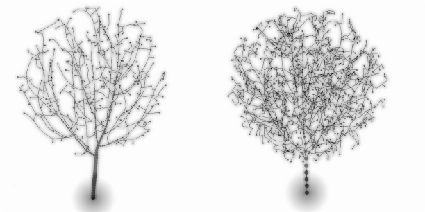

# space_col


The [space colonization algorithm](http://www.algorithmicbotany.org/papers/colonization.egwnp2007.large.pdf) is a model simulating the growth of branching structures like trees or blood vessels. It can also be used for engineering problems like design of road networks or power distribution. This is a Python implementation written using the shared_memory module of Python 3.8 and numpy.

# Usage

See jupiter examples and stress tests in `test_ipy/main.py`. There are plotting functions in the `juputil` folder which rely on the [plotly](https://plotly.com) library. Use the `PointGenerator.py` class to generate different types of random distributions. Basic workflow:

```
import SCA
from PointGenerator import PointGenerator as PG
from SCA.util import Param as Param
from juputil.Plotters import tree_plot as T_plot, stat_plot as S_plot, dist_plot as D_plot

def vec(x,y,z):
    return np.array([x,y,z])

'''Create 800 uniformly ditributed points in a sphere:'''
pts = PG.sphere(N=800,R=1.0, C=vec(0,0,1.5)) 
'''The parameters roughly follows Runions et. al., 2007. See linked pdf above.'''
par = Param(0.03, 0.8, 0.1, vec(0,0,0.1))
'''All points are set as active when the iteration starts. Else, the growth may halt before the tree has reached the domain of the attractor. The trunk_lim parameter determines how many points need to be activated before the algorithm proper can start.'''
T = SCA.SpaceColony(points=pts, parameters=par, trunk_lim=10)

T.iterate(300)
S_plot(T) # Plot size, growth rate and activation data
T.walk()  # Walk the tree to generate edges for plotting
T_plot(T) # Marvel at an interactive 3D plot of the result.

```

# Implementation details

The thickness of branch node `n` is calculated from an observation made on actual bona-fide real-life trees: 


The halt condition code deserves some explaining. `SpaceColony.done_yet()` keeps track of how many points are activated and counts terminates execution if activation has not changed for `yeet_condition` iterations. Sorry about the naming. This detects corner cases where branches are bouncing back-and-forth without ever reaching the `kD`region of an attraction point. 

The `Horse` process can be coerced into using arbritrary functions for distance calculations and the attractiveness of the attractor. The default behaviour is square euclidean distance and the norm of the 

# Status
 This code will eventually be turned into a Blender plugin. For now I just leave it here, waiting for Blender to bump to a newer interpreter. 